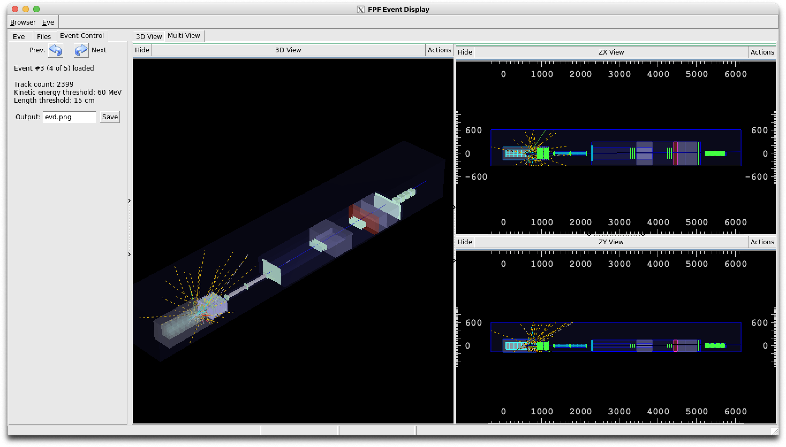

# FPFDisplay



FPFDisplay is an interactive event display for the output of [FPFSim](https://github.com/FPFSoftware/FPFSim) based on the ROOT TEve framework.
It provides a tool to visualize the FPF geometry as well as simulated events in both 3D and 2D projections.

## How to build

- Source the CERN LCG software stack from `cvmfs`: `source setup_cvmfs.sh`.
- Create a new directory to contain the executables (assume the path is `/path/to/build`).
- Assume the path to the source code is `/path/to/source`.
- To compile, you need to go to the build directory `cd /path/to/build`.
- And then `cmake -S /path/to/source -B /path/to/build`.
- Finally, `make`.

After a successful build, the `FPFDisplay` executable will be available in `build/`.

## Running

You can run the event display with the following command:
```
./FPFDisplay <geometry.gdml> [datafile.root]
```
- `<geometry.gdml>`  
  GDML file exported from FPFSim using the `/det/saveGdml` macro command.

- `[datafile.root]` (optional)  
  FPFSim output ROOT file containing saved trajectory information.
  ```
  /tracking/storeTrajectory 1
  /histo/saveTrack true
  ```
  If provided, FPFDisplay will overlay tracks from this file on the geometry.

### Navigation

You can navigate the display in the following ways:
- You can use the mouse to rotate or zoom the geometry. 
- You can use the arrow keys to pan the geometry, recentering the camera.
- If you click on a track, it will get highligthed across the views.
- You can move across events using the "Prev." and "Next" buttons in the "Event control" tab.

### Saving images

You can save the displays by clicking the "Save" button in the "Event control" tab.
This will capture the current status of all viewers, including zoom and camera orientation.
The output filename can be customized by using the input field next to the "Save" button.
The default name is `evd.png`. 
Note that the `pdf` extension can be used, but it does not fully support transparency and texturing.

### Using VNC on lxplus

If running on `lxplus`, it is better to do it through a VNC server.
An helper script `lxplus_vnc_setup.sh` is provided to start one according to CERN guidelines.
It determines the port and the command you need to run, given your user id to avoid clashes with other people.

Follow the on-screen instructions, for example:
1. Run `lxplus_vnc_setup.sh` once on `lxplus`.
2. Then, in your local terminal, set up an SSH tunnel (port will be shown by the script):  
   ```
   ssh -L <VNC_PORT>:localhost:<VNC_PORT> <username>@lxplus.cern.ch
   ```
3. Launch your VNC client and connect to `localhost:<VNC_PORT>`.
4. The VNC sever automatically disconnects as you log off. 
